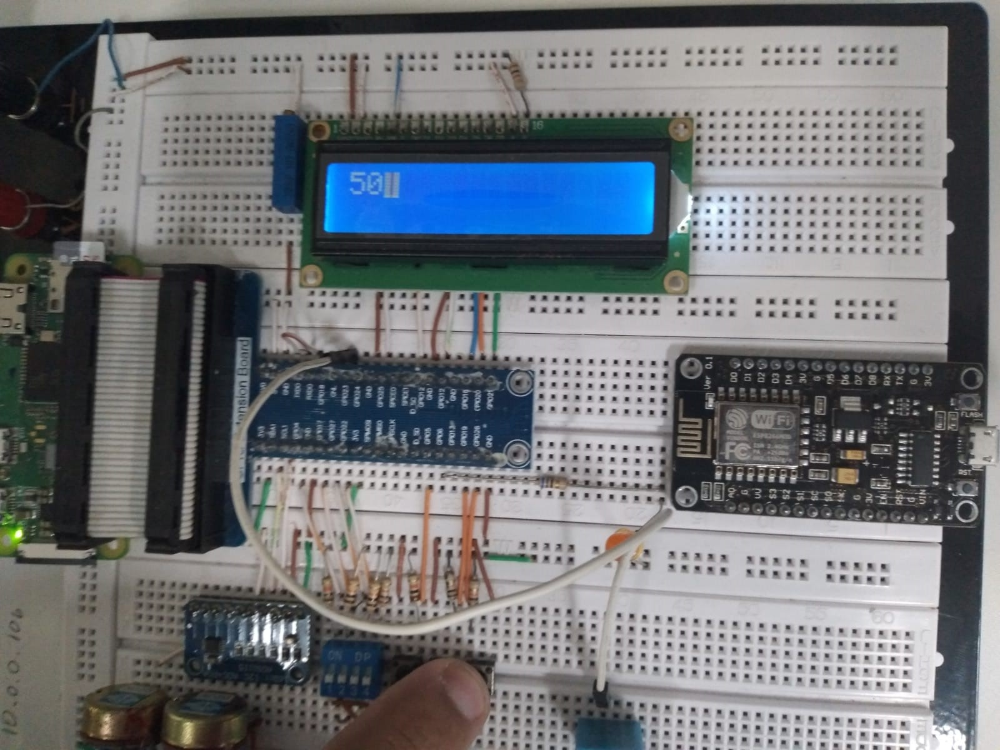

# Projeto Timer Assembly

> #### Disciplina: TEC499

> #### Turma: PO1

> #### Grupo: 3 (Adriel, Alisson, Marcos)

---

## 1. Acerca do projeto

Este projeto foi desenvolvido com a intenção de desenvolver uma aplicação assembly que simule um contador. O código foi desenvolvido para a raspberry PI 0 e faz uso de um display LCD específico desse kit para a exibição dos valores contidos no contador.

## 2. Código-fonte

O código fonte deste projeto está escrito em assembly voltado para a arquitetura ARM.

### 2.1. Estruta de arquivos

```
TEC499-GP03
│
|───README.md #Relatório e documentação do projeto
│───makefile #script de montagem
|───time.s #arquivo principal contendo todas as instruções assembly da aplicação
```

## 3. Ferramentas utilizadas

### 3.1. Editores de código

Foram usados três ferramentas para criação e edição dos arquivos presentes neste projeto sendo 1 IDE e 2 editores de texto. A IDE foi o [Visual Studio Code](https://code.visualstudio.com/) e os editores de texto foram o [notepad ](https://www.microsoft.com/pt-br/p/bloco-de-notas/9nblggh08vx8) do windows e o [nano ](https://www.nano-editor.org/) editor de texto do ubuntu.

### 3.2. Ferramentas de versionamento

Para o versionamento de código foram utilizaods o [git ](https://git-scm.com/) e o [github](https://github.com/).

### 3.3. Sistemas operacionais

Todo o código foi criado e editado nos ambientes windows 10 e ubuntu 18, ambos com arquitetura de 64 bits. A execução do código se deu através do próprio OS da Raspberry PI 0, conhecido comumente como Raspbian.

### 3.4. Emuladores

Para suprir a ausência da placa nos dias que não tínhamos acesso a ela, foi usado o software [QEMU](https://www.qemu.org/) para emular o sistema operacional Raspbian.

### 4. Testes

Os testes do projeto, no geral, foram feitos a partir de casos de testes que consistiam na utilização das principais funções do código.

### 4.1. Casos de teste

Se descartarmos a possibilidade de impecilhos ou problemas durante o procedimento e considerarmos apenas o fluxo básico esperado da aplicação, teremos o seguinte caso de uso - que também foi testado:

```
Iniciar contagem clicando o botão
Inciar contagem segurando o botão
Pausar a contagem clicando o botão
Pausar a contagem segurando o botão
Reiniciar a contagem clicando o botão
Reiniciar a contagrm segurando o botão
Contagem de um dígito visivel no display
Contagem de dois dígitos visivel no display
Trocar contagem de dois dígitos para um
Trocar contagem de um dígito para dois
Clear deve ocorrer ao iniciar o display
Clear deve ocorrer antes de escrever um dígito
```

Abaixo está uma imagem para representar a aplicação executando a cadeia de passos listada anteriormente e apresentando no display o valor 50 (adotado nesse caso como ponto de partida para a contagem regressiva).



### 5. Instalação e execução

A execução da aplicação requer propriamente um ambiente linux por se tratar da raspberry, cujo O.S. também é linux. Por padrão, algumas distribuições baseadas em debian como o ubuntu possuem as bibliotecas necessárias para instalação/compilação e execução da aplicação.
Na ausência de bibliotecas suficientes, pode-se optar por instalar a nasm através do comando `sudo apt get install nasm`. A seguir está a cadeia de passos restantes:

* Conversão inicial: `as time.s -o time.o`
* Criação do executável: `ld time.o -o time`
* Execução: `./time`

Caso haja falha de segmentação, é recomendável executar os comandos como SuperUser (root).

Vale lembrar que todo o procedimento acima pode ser contornado apenas [clonando ](https://docs.github.com/pt/repositories/creating-and-managing-repositories/cloning-a-repository#:~:text=Clonar%20um%20reposit%C3%B3rio%20extrai%20uma,outras%20pessoas%20no%20GitHub.com.) o projeto em um diretório local e executando o comando `make`, onde o makefile se encarregará de passar as instuções para o sistema linux.

